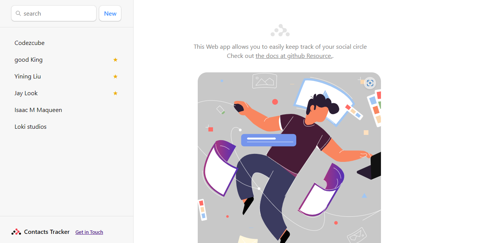

# contacts-tracker-app

> Contacts Tracker is rich feature web app :
- This Web app allows you to easily keep track of your social circle

[Live Page]('')

# Built with

- Reactjs
- Vite
- CSS & HTML5
- JavaScript
- Localforage

## Live Demo (available)

Feel free to check the [Live Demo]( https://kinginthenorthcodez.netlify.app)

# Getting Started with Create React App

This project was bootstrapped with [Create React App](https://github.com/facebook/create-react-app).

## Available Scripts

In the project directory, you can run:

### `npm run dev`

### `npm run build`

### `npm run preview`


Runs the app in the development mode.\
- You should be able to visit the URL printed in the terminal:
```
> vite preview

  ➜  Local:   <http://127.0.0.1:4173/>
  ➜   Network: use --host to expose

```
## Authors

👤 **Author1**

- GitHub: [@kinginthenorthcodez](https://github.com/kinginthenorthcodez)

## 🤝 Contributing

Contributions, issues, and feature requests are welcome!

Feel free to check the [issues page](https://github.com/kinginthenorthcodez/contacts-tracker-app/issues).

## Show your support

Give a ⭐️ if you like this project!

## Acknowledgments
- google & stackoverflow
- open source community

## 📝 License

This project is [MIT](./MIT.md) licensed.
